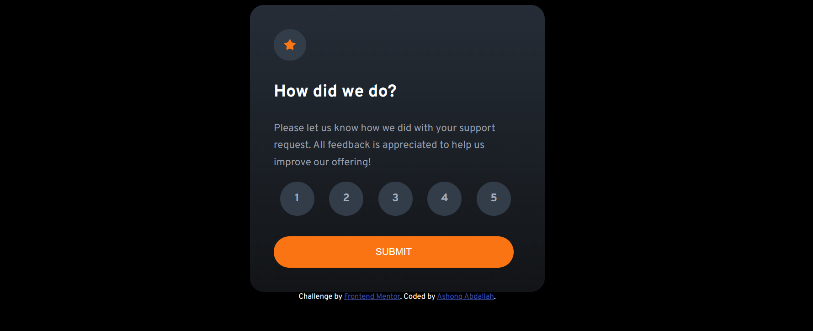
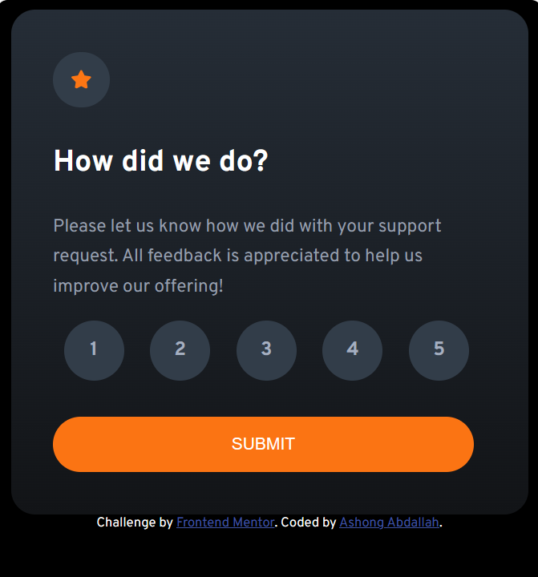

# Frontend Mentor - Interactive rating component solution

## Table of contents

- [Overview](#overview)
  - [Screenshot](#screenshot)
  - [Links](#links)
- [My process](#my-process)
  - [Built with](#built-with)
- [Author](#author)

**Note: Delete this note and update the table of contents based on what sections you keep.**

## Overview

### Screenshot
**Desktop Design**

**Mobile Design**

### Links
- Solution URL: [https://www.frontendmentor.io/solutions/interactive-rating-component-LdbSnr-1t8]
- Live Site URL: [https://main-interactive-rating-component.netlify.app/]

## My process

### Built with

- HTML
- CSS
- Flexbox
- Javascript

## Author
<!-- - Website - [Add your name here](https://www.your-site.com) -->
- Frontend Mentor - [@AshongAbdallah06](https://www.frontendmentor.io/profile/AshongAbdallah06)
- Twitter - [@XuGaR_2_0_0_6](https://www.twitter.com/yourusername)